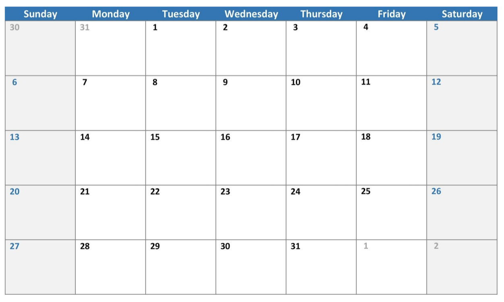

# vue-agenda

## Description

This project is designed to test your knowledge of front-end web technologies and assess your ability to create front-end UI products with attention to details, cross-browser compatibility, standards, and reusability.

## Assignment

The goal of this exercise is to create a demo calendar application using React, Vue or Angular.

You should start by rendering a single month view of a calendar for the current month – along
with the lines of the below illustration:



## Mandatory Features

- Ability to add a new "reminder" (max 30 chars) for a user entered day and time. Also, include a city.

- Display reminders on the calendar view in the correct time order.

- Allow the user to select color when creating a reminder and display it appropriately.

- Ability to edit reminders – including changing text, city, day, time and color.

- Add a weather service call from a free API such as Open Weather Map, and get the weather forecast (ex. Rain) for the date of the calendar reminder based on the city.

- Unit test the functionality: Ability to add a new "reminder" (max 30 chars) for a user entered day and time. Also, include a city.

## Bonus

- Expand the calendar to support more than the current month.

- Properly handle overflow when multiple reminders appear on the same date.

- Functionality to delete one or ALL the reminders for a specific day.

## Considerations

- Redux (or any other state manager) structure of the calendar.

- The project is totally focused on the front-end; please ignore the back-end.

- Keep your code versioned with Git.

- Feel free to use small helper libraries for:

  - UI Elements.
  - Date/Time handling.

- You must create the calendar component yourself. Do not use calendar libraries like FullCalendar or Bootstrap Calendar.

- If you use an external API, make sure to provide working API keys.

## Build Setup

```bash
# install dependencies
$ yarn install

# serve with hot reload at localhost:3000
$ yarn dev

# build for production and launch server
$ yarn build
$ yarn start

# generate static project
$ yarn generate
```

For detailed explanation on how things work, check out [Nuxt.js docs](https://nuxtjs.org).

## Getting started

To run the project you just need to copy the .env.example, according to the command below:

`cp .env.example .env`

Run `yarn` to install the dependencies

Then run `yarn dev` and access the `localhost:3000`

That's it
